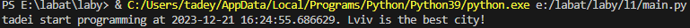

# Звіт до роботи
## Тема: оформлення робіт та перша програма
### Мета роботи: навчитися робити прості програми і звіт
---
### Виконання роботи
- Результати виконання завдання 1;
    1. Створено файл з розширенням`.py` та написано першу програму яка знаходиться у файлі [main.py](main.py);
    1. Результат виконання програми на скріншоті: ;
    1. Створили [Python Notebook](nb.ipynb) та додали пояснення до коду;
    1. Створили новий [Python Notebook](chatGPT.ipynb) в якому вставили відповідь від ChatGPT де він нам рекомендував першу програму.
    1. Модифікували програму додавши використання бібліотеки time та запитались у ChatGPT як перевести час з Epoch до нормального(зрозумілого людині);
    1. Навчились створювати та запускати програми на Python Notebook., та за допомогою ChatGPT модифікували нашу першу програму.

- попрактикувались вставляти код та результат простим копіюванням:
from datetime import datetime
name = "tadei"
location = "Lviv"

print(f"{name} start programming at {datetime.now()}. {location} is the best city!")

- програма вивела:

PS  E:\labat\laby> & C:/Users/tadey/AppData/Local/Programs/Python/Python39/python.exe e:/labat/laby/l1/main.py
tadei start programming at 2023-12-21 16:26:01.033729. Lviv is the best city!

- Індивідуальне завдання: попрацювали з ChatGPT.

### Висновок: 
> у висновку потрібно відповісти на запитання:
- :question: Що зроблено в роботі: виконали першу програму на Python, попрацювали у Python Notebook, задали запит ChatGPT та оформили звіт;
- :question: Чи досягнуто мети роботи:+1:
- :question: Які нові знання отримано: Навчились працювати з Python Notebook в інтерактивному режимі.
- :question: Чи вдалось відповісти на всі питання задані в ході роботи:так
- :question: Чи вдалося виконати всі завдання:так
- :question: Чи виникли складності у виконанні завдання:складностей не виникало
- :question: Чи подобається такий формат здачі роботи (Feedback):так дуже подобається
- :question: Побажання для покращення (Suggestions);
---